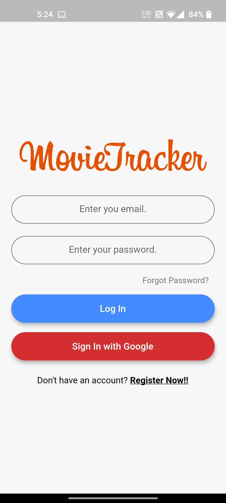
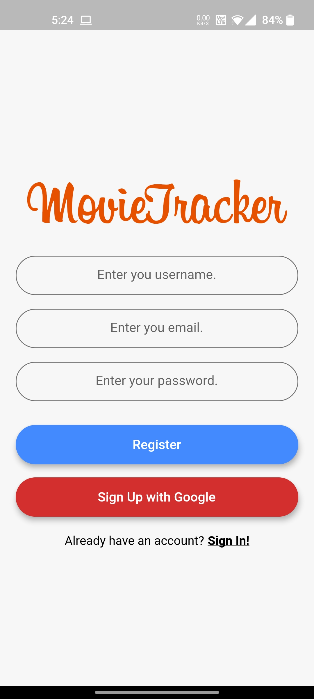
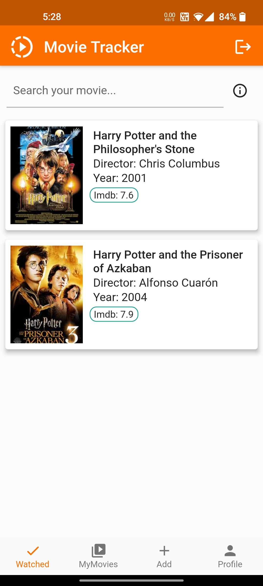
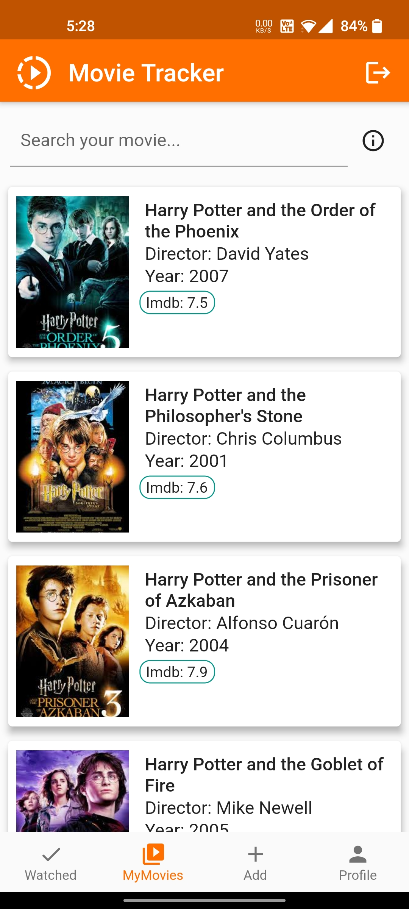
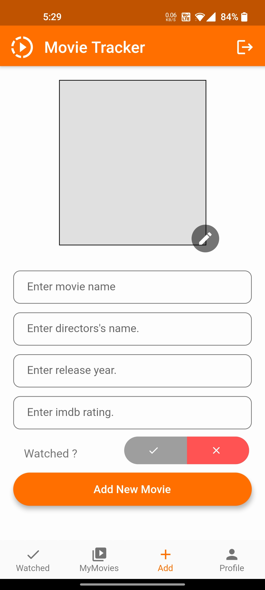
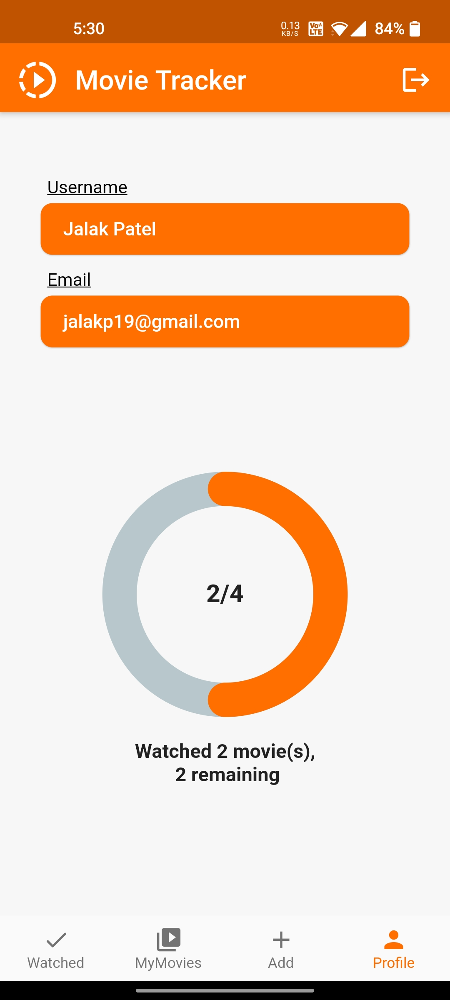
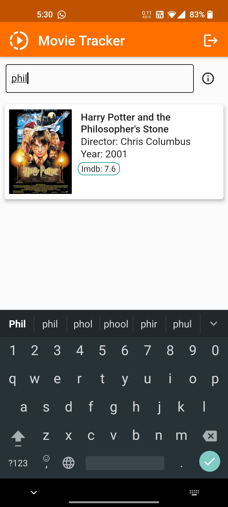
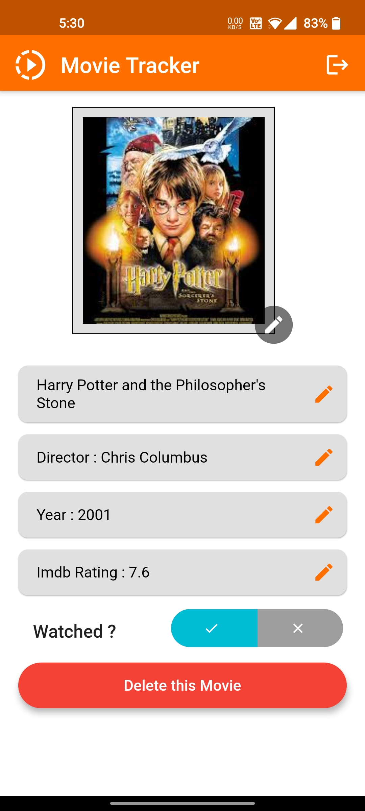

# Movie Tracker

Mobile application built using Flutter, Firebase and sqflite(SQL package for local storage)

## Images

                     

## About

- Login Screen: You can login with email and password as well as google. Upon forgot password, you will be sent a password reset link
- Register Screen: You can register through email as well as google. You will be sent an email verification link. Once verified, only then you will be able to logIn
- Watched Screen: All the watched movies would appear here. You can remove the movie from the watched list as well
- MyMovies Screen: All the movies added by the user would appear here. You can search for any book by:
   - Movie name
   - Directors's name
   - Release year
   - Imdb rating
- Add Movie Screen: Allows user to add a movie to their collection 
- Movie Screen: Displays the movie details and provides the functionality to edit and delete the movie.
- Profile Screen: Displays the user details as well as an animated progress bar which displays the number of movies watched and the number of movies remaining.

## Technologies Used

- Flutter
- Firebase
    - Firebase Auth (lib/AUTH/auth.dart)
- SQL
    - sqflite (lib/CRUD/database.dart) 
   
---
   
>Feel free to use the code in your own Flutter project

## Author

**- Jalak Patel (https://github.com/jalakp19)**
